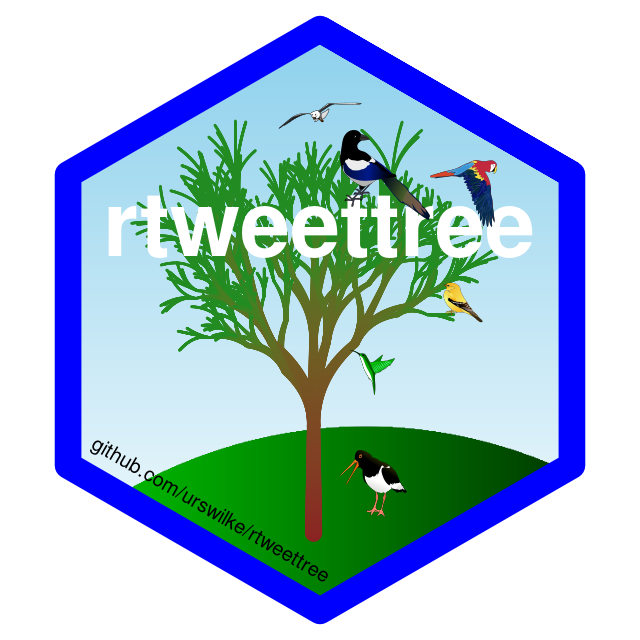

<!-- README.md is generated from README.Rmd. Please edit that file -->

```{r, include = FALSE}
knitr::opts_chunk$set(
  collapse = TRUE,
  comment = "#>"
)
```

# rtweettree_hex

This repository was used to create the hex sticker of the package
[rtweettree](https://github.com/urswilke/rtweettree).

```{r echo=FALSE}

```


It was done with the
awesome packages 

- [flametree](https://github.com/djnavarro/flametree),
- [magick](https://github.com/ropensci/magick), 
- [dplyr](https://github.com/tidyverse/dplyr/), and
- [ggplot2](https://cran.r-project.org/web/packages/ggplot2/index.html).
- [ggpattern](https://github.com/coolbutuseless/ggpattern).


 The birds images in the repo were downloaded as svgs from http://www.clker.com/.
