<!-- README.md is generated from README.Rmd. Please edit that file -->

# svg hex

The files in this folder are the result of playing around with svg. I
used the R package
[minisvg](https://github.com/coolbutuseless/minisvg/). The tree was
created with [flametree](https://github.com/djnavarro/flametree).

<!-- -->

The final svg [minisvg.svg](minisvg.svg) is created with
[create\_svg\_hex.R](create_svg_hex.R). Unfortunately, the file is not
completely rendered when you view it on github. But when you download
it, you can can view it in firefox.
