<!-- README.md is generated from README.Rmd. Please edit that file -->

# svg hex

The files in this folder are the result of playing around with svg. I
used the R package
[minisvg](https://github.com/coolbutuseless/minisvg/). The tree was
created with [flametree](https://github.com/djnavarro/flametree).

<!-- -->

The final svg [minisvg.svg](minisvg.svg) is created with
[create\_svg\_hex.R](create_svg_hex.R). Unfortunately, the file is not
completely rendered when you view it on github. But when you download
it, you can can view it correctly in firefox. This is because the file
includes svg child images from the internet. Those are only correctly
shown when I render it as a local file on my machine.

However, I made another standalone svg file
[minisvg\_with\_tree.svg](minisvg_with_tree.svg), where I copy-pasted
the single elements of the [tree2.svg](tree2.svg) file into the hex svg.
It has some bizarre unintentional effects, but looks interesting though.
